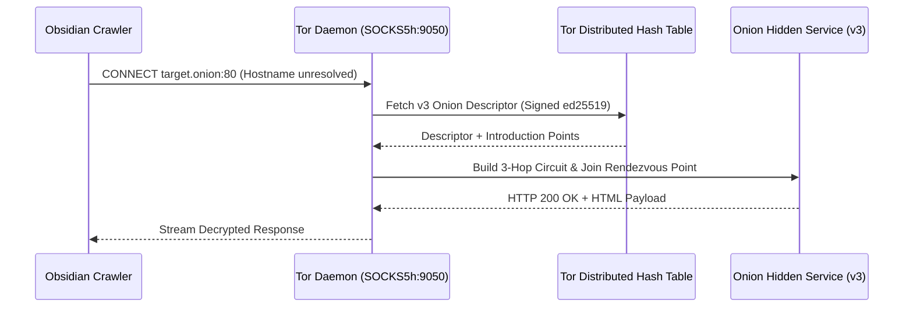

# OBSIDIAN: System Architecture & Technical Specifications

This document provides a comprehensive technical blueprint of the **Obsidian Dark Web Threat Actor De-Anonymization and Attribution Platform**. It details the subsystem design, network routing, forensic algorithms, mathematical fusion models, and data flows.

---

## 1. High-Level System Architecture

```mermaid
flowchart TB
    subgraph UI_WORKSTATION ["Analyst Workstation (React 19 + TypeScript + Tailwind)"]
        A1["Overview & Case Dossier"]
        A2["Setup & Tor Testbed Diagnostics"]
        A3["Infra Recon & Leak Analyzer"]
        A4["D3.js Force-Directed Entity Graph"]
        A5["Behavioral Stylometry Engine"]
        A6["Mathematical Fusion Matrix"]
        A7["Export Center (STIX 2.1 / Dossier / CSV)"]
    end

    subgraph API_GATEWAY ["Application & Gateway Layer (Node / Express + Vite)"]
        B1["Reverse Proxy (Port 3000)"]
        B2["Session & State Handler"]
        B3["Simulated & Offline Telemetry Fallback"]
        B4["AI Forensic Evaluation Client"]
    end

    subgraph BACKEND_ENGINE ["Core Intelligence Engine (FastAPI - Port 8000)"]
        C1["FastAPI Router (/api/*)"]
        C2["Crawler & Pipeline Worker (crawler.py)"]
        C3["Infrastructure Scanner (scanner.py)"]
        C4["Stylometric Vectorizer (stylometry.py)"]
        C5["Onion Service Manager (onion_manager.py)"]
        C6["AI Case Synthesis Engine"]
    end

    subgraph STORAGE_LAYER ["Forensic Evidence Store"]
        D1[("SQLite Database: obsidian.db\n• urls (Crawl Queue)\n• listings (Extracted Evidence)\n• infra_scans (Recon Telemetry)\n• stylometry_scores\n• cases & cases_dossier")]
    end

    subgraph TOR_ROUTING ["Isolated Network Transport Layer"]
        E1["Tor Daemon Proxy (dockurr/tor - Port 9050)"]
        E2["SOCKS5h Remote DNS Resolver"]
        E3["Tor Circuit Manager & Control Port (9051)"]
    end

    subgraph TARGET_ENVIRONMENT ["Target Darknet Environment"]
        F1["Sandboxed Docker Bridge (onionnet)"]
        F2["7x Tor v3 Hidden Services (*.onion)"]
        F3["Apache 2.4 Web Cluster (testbed/ htdocs)"]
        F4["[Production Mode] Live Global Tor Network"]
    end

    UI_WORKSTATION <-->|HTTP / WebSocket / JSON| API_GATEWAY
    API_GATEWAY <-->|REST API Proxy| BACKEND_ENGINE
    BACKEND_ENGINE <-->|SQL Queries & Transactions| STORAGE_LAYER
    BACKEND_ENGINE <-->|SOCKS5h Proxy Calls (socks5h://127.0.0.1:9050)| TOR_ROUTING
    TOR_ROUTING <-->|3-Hop Cryptographic Circuits| TARGET_ENVIRONMENT
```

---

## 2. Subsystem Deep-Dive

### 2.1 Network Transport & SOCKS5h Routing Subsystem
- **DNS Leak Prevention**: Standard socket connections attempt local OS DNS resolution, which fails for `.onion` top-level domains and leaks lookup metadata to local ISPs. Obsidian enforces `socks5h://` protocol semantics via `PySocks` and `requests.Session`. The trailing `h` guarantees that hostnames are transferred as raw byte arrays directly to the Tor client daemon for cryptographic Distributed Hash Table (HSDir) lookup.
- **Circuit Construction**: Tor client constructs 3-hop encrypted circuits (Guard → Middle → Exit/Rendezvous) to access onion service introduction points.
- **Tor Control Port Integration**: Interacts with `127.0.0.1:9051` to monitor circuit health (`GETINFO circuit-status`), inspect published descriptors (`GETINFO hs/service/desc/id/...`), and trigger automated guard rotation (`DROPGUARDS`, `SIGNAL NEWNYM`) if relays experience network saturation.



---

### 2.2 Breadth-First Tor Crawler Subsystem (`backend/crawler.py`)
- **Queue Architecture**: Implements a persistent, crash-resilient breadth-first search (BFS) queue backed by SQLite:
  ```sql
  SELECT url FROM urls WHERE crawled = 0 LIMIT 1;
  ```
- **Autonomous Multi-Host Discovery**: Parses standard HTML `<a>` tags via BeautifulSoup. Discovered hyperlinks ending in `.onion` are normalized via `urllib.parse.urljoin` and pushed into the queue with `INSERT OR IGNORE`.
- **Payload Safety Cap**: Enforces a strict 500 KB payload ceiling per page (`resp.text[:500_000]`) to protect against darknet decompression bombs, infinite DOM loops, and memory exhaustion attacks.
- **Regex Entity Extraction**:
  - **OpenPGP Blocks**: `-----BEGIN PGP PUBLIC KEY BLOCK-----.*?-----END PGP PUBLIC KEY BLOCK-----`
  - **Cryptocurrency Wallets**: `\b(bc1[a-z0-9]{25,60}|[13][a-km-zA-HJ-NP-Z1-9]{25,34})\b` (supporting Legacy `1...`, SegWit Script `3...`, and Bech32 `bc1...`).
  - **Provenance Hashing**: SHA-256 hash computed over sanitized listing text for deduplication and cryptographic chain of custody.

---

### 2.3 Active & Passive Infrastructure Reconnaissance Subsystem (`backend/scanner.py`)
- **Port Probing over Tor**: Multi-threaded socket scans (`ports: [80, 443, 22, 9050]`) through the local Tor proxy using non-blocking socket timeouts.
- **Server Misconfiguration & Status Leaks**: Systematically probes unhardened server diagnostic endpoints:
  - `/server-status` (Apache `mod_status` module disclosing worker threads, active client IPs, and uptime).
  - `/.env`, `/.git/config`, `/robots.txt`.
- **Origin IP & ASN Extraction**: Parses leaked origin addresses, mapping them to geographic coordinates, ISP names, and Autonomous System Numbers (e.g., AS9009, AS55836) to pinpoint physical hosting infrastructure.
- **TLS/SSL Fingerprint Harvesting**: Intercepts TLS X.509 certificates over Tor port 443, extracting SHA-256 certificate fingerprints, Common Names (CN), and Subject Alternative Names (SANs) to identify clearnet staging servers and domain reuse.

---

### 2.4 Multi-Entity Graph Correlation Subsystem (`ModuleEntityGraph.tsx`)
- **Graph Topology**: Represents the threat landscape as a multi-typed heterogeneous graph:
  $$G = (V, E)$$
  Where $V$ represents entities:
  $$\{ \text{Threat Actor}, \text{Marketplace}, \text{Forum}, \text{PGP Key}, \text{Crypto Wallet}, \text{Origin IP} \}$$
  And $E$ represents directed evidentiary relationships:
  $$\{ \text{OPERATES\_ON}, \text{USES\_PGP}, \text{CONTROLS\_WALLET}, \text{LEAKS\_ORIGIN} \}$$
- **Force-Directed Physics**: Rendered using **D3.js** (`d3-force`) with dynamic link distance, charge repulsion, and collision boundaries.
- **Pathfinding & Shortest-Path Tracing**: Implements a client-side Breadth-First Search (BFS) algorithm to isolate the shortest evidentiary path between a targeted pseudonym and a leaked origin IP address.
- **Forensic Filtering Toolbar**: Fast toggles to filter by node type (`pgp`, `wallet`, `actor`, `marketplace`, `origin_ip`), eliminating visual noise during investigation.
- **Query Console**: Includes an integrated Cypher-compatible query interface simulating graph traversal queries (`MATCH (a:ThreatActor)-[r]->(target) RETURN a, r, target`).

---

### 2.5 Behavioral Stylometry & Linguistic Profiling Subsystem (`stylometry.py`)
- **Dual-Phase Attribution**: Combines deterministic statistical feature vectorization with on-demand AI linguistic auditing.
- **Feature Vector Space**:
  1. **Function-Word Frequencies**: Vectorizes 40+ non-contextual function words (prepositions, modal verbs, auxiliary verbs, conjunctions) which remain constant regardless of topic.
  2. **Punctuation & Syntax Cadence**: Analyzes frequencies of commas, ellipses, semicolons, brackets, and exclamation marks per 1,000 characters.
  3. **Lexical Richness Metrics**: Computes Yule's Characteristic $K$ and Simpson's Diversity Index $D$:
     $$K = 10^4 \times \frac{\sum_{i=1}^\infty i^2 V(i, N) - N}{N^2}$$
- **Cosine Concordance Score**: Computes the inner product of normalized frequency vectors:
  $$\text{Similarity}(A, B) = \frac{\mathbf{v}_A \cdot \mathbf{v}_B}{\|\mathbf{v}_A\| \|\mathbf{v}_B\|}$$
- **AI Forensic Linguistic Audit**: An integrated AI evaluation engine acts as a Senior Digital Forensics Linguistic Specialist, producing a 4-section memorandum analyzing subconscious grammatical markers and generating an evidentiary authorship conclusion.

---

### 2.6 Mathematical Fusion Layer & Evidence Ledger (`FusionLayer.tsx`)
Rather than relying on black-box predictions, Obsidian aggregates independent telemetry streams into a **mathematically weighted composite attribution score**:

$$\text{Composite Score} = (w_{\text{infra}} \cdot S_{\text{infra}}) + (w_{\text{graph}} \cdot S_{\text{graph}}) + (w_{\text{stylo}} \cdot S_{\text{stylo}})$$

| Signal Layer | Default Weight ($w$) | Primary Evidence Stream | Reliability / Justification |
| :--- | :---: | :--- | :--- |
| **Infrastructure Recon ($S_{\text{infra}}$)** | **0.40** | Clearnet origin IP, `/server-status` leak, TLS SHA-256 cert reuse | Highest objective reliability (direct physical host linkage). |
| **Entity Graph ($S_{\text{graph}}$)** | **0.35** | 4096-bit RSA OpenPGP fingerprint match, Bitcoin SegWit UTXO co-spend | Cryptographically infallible private key / wallet possession. |
| **Behavioral Stylometry ($S_{\text{stylo}}$)** | **0.25** | Subconscious function-word cosine similarity, Yule's K vocabulary curve | Corroborating behavioral proof across alias rebranding. |

---

## 3. Database Schema (`obsidian.db`)

```sql
-- Discovered and crawled URLs queue
CREATE TABLE IF NOT EXISTS urls (
    id INTEGER PRIMARY KEY AUTOINCREMENT,
    url TEXT UNIQUE NOT NULL,
    crawled INTEGER DEFAULT 0,
    discovered_at TEXT NOT NULL,
    crawled_at TEXT
);

-- Extracted Darknet Marketplace / Forum Listings
CREATE TABLE IF NOT EXISTS listings (
    id INTEGER PRIMARY KEY AUTOINCREMENT,
    url TEXT NOT NULL,
    hostname TEXT NOT NULL,
    source_site TEXT NOT NULL,
    handle TEXT,
    category TEXT,
    listing_text TEXT,
    snippet TEXT,
    content_hash TEXT,
    pgp_key TEXT,
    wallet_address TEXT,
    timestamp TEXT,
    extracted_at TEXT NOT NULL
);

-- Passive & Active Infrastructure Reconnaissance Telemetry
CREATE TABLE IF NOT EXISTS infra_scans (
    id INTEGER PRIMARY KEY AUTOINCREMENT,
    hostname TEXT UNIQUE NOT NULL,
    scan_json TEXT NOT NULL,
    scanned_at TEXT NOT NULL
);

-- Statistical Stylometric Comparison Scores
CREATE TABLE IF NOT EXISTS stylometry_scores (
    id INTEGER PRIMARY KEY AUTOINCREMENT,
    handle_a TEXT NOT NULL,
    handle_b TEXT NOT NULL,
    similarity_score REAL NOT NULL,
    metrics_json TEXT NOT NULL,
    computed_at TEXT NOT NULL
);
```

---

## 4. REST API Endpoint Reference

| Method | Endpoint | Description |
| :--- | :--- | :--- |
| `GET` | `/api/health` | System diagnostics, Tor connectivity, and active onion service counts. |
| `GET` | `/api/onion-targets` | Returns active onion addresses discovered in the environment. |
| `POST` | `/api/infra-scan` | Executes full SOCKS5 port scan, server banner grab, and leak analysis. |
| `POST` | `/api/run-investigation` | Triggers asynchronous breadth-first crawling and evidence extraction. |
| `GET` | `/api/investigation-status` | Polls progress (pages processed, listings harvested, scan status). |
| `GET` | `/api/entity-graph` | Returns nodes and links for D3.js force-directed graph rendering. |
| `POST` | `/api/stylometry/compare` | Compares two listing texts and computes cosine similarity + Yule's K. |
| `GET` | `/api/fusion-signals` | Calculates multi-signal weighted scores and verifiable evidence proofs. |
| `POST` | `/api/gemini-persona-audit` | Generates a 4-section AI linguistic forensics audit memorandum. |
| `POST` | `/api/gemini-case-synthesis`| Generates a court-admissible NTRO de-anonymization intelligence dossier. |
| `POST` | `/api/gemini-infra-analysis` | Produces an automated infrastructure attack surface and subpoena evaluation. |

---

## 5. Defense & Intelligence (NTRO) Interoperability

Obsidian is built from the ground up to integrate with government and law enforcement intelligence ecosystems:

1. **STIX 2.1 Standard Compliance**:
   Translates all correlated entities into structured STIX objects:
   - `threat-actor` (Operator handles and observed aliases)
   - `infrastructure` (Onion services, open ports, leaked IPs)
   - `identity` (Vendor personas, forums, marketplace syndicates)
   - `relationship` (`attributed-to`, `uses`, `communicates-with`)
2. **Chain of Custody Cryptographic Provenance**:
   Every harvested HTML payload, wallet match, and PGP key block is bound to a SHA-256 digest with UTC timestamping, ensuring compliance with electronic evidence requirements under Section 65B of the Indian Evidence Act and the Daubert Standard for forensic admissibility.
3. **Agency REST API Stream**:
   Enables automated ingestion into centralized SIEM / SOAR platforms (MISP, OpenCTI, Maltego, IBM i2 Analyst's Notebook) for unified threat landscape visibility.
